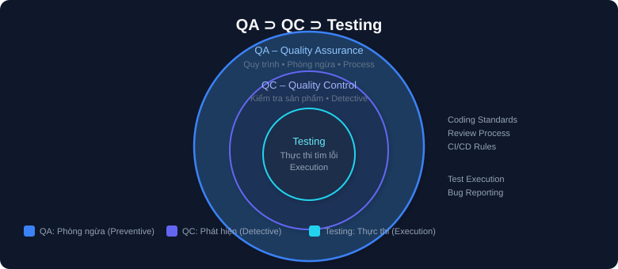
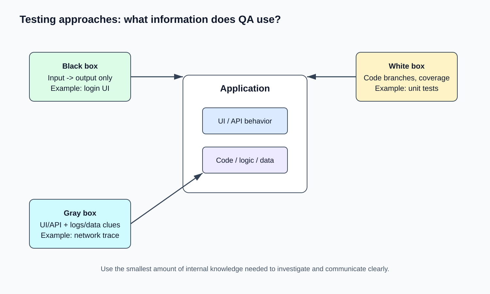
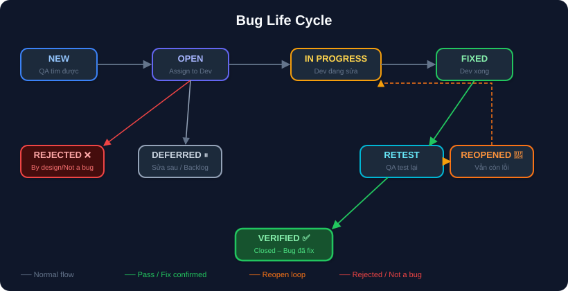
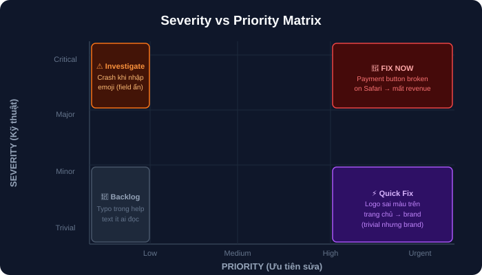

# 02 — QA Foundations: Tư Duy & Nền Tảng QA

## Mục tiêu
Hiểu bản chất QA là gì, tư duy khác developer ra sao, phân biệt Verification vs Validation, nắm vững 7 nguyên tắc ISTQB, Bug Life Cycle, và Severity vs Priority.

---

## 1. QA vs QC vs Testing

| Khái niệm | Định nghĩa & Mục tiêu | Tính chất | Ví dụ |
|---|---|---|---|
| **QA (Quality Assurance)** | Tập trung vào **quy trình** — đảm bảo cách làm đúng để sản phẩm ít lỗi nhất | Phòng ngừa (Preventive) | Coding standards, Code review checklist, CI/CD pipeline rule |
| **QC (Quality Control)** | Tập trung vào **sản phẩm** — kiểm tra sản phẩm có đạt chuẩn không | Phát hiện (Detective) | Chạy bộ test, kiểm tra output của build |
| **Testing** | Hoạt động thực thi cụ thể nằm trong QC để tìm lỗi | Thực thi (Execution) | Nhập wrong password -> check error message |

> 💡 **Cách nhớ:** QA = "Làm đúng cách" ➔ QC = "Sản phẩm đúng chưa" ➔ Testing = "Chạy thử tìm lỗi".

---

## 2. QA Mindset: Adversarial & Systemic Thinking

Dev khi code feature "Form đăng ký" nghĩ:
> "User nhập tên, email, password ➔ validate ➔ lưu DB ➔ redirect dashboard. Done."

QA khi test cùng feature nghĩ:
> "Nếu user nhập toàn space? Nếu email có dấu '+'? Nếu password đúng 8 ký tự biên? Nếu click submit 2 lần liên tiếp? Nếu mất mạng giữa chừng?"

---

## 3. Ba testing approach (What information does QA use?)

- **Black box:** chỉ nhìn input và output. Ví dụ nhập username/password, kiểm tra điều hướng và thông báo lỗi.
- **White box:** nhìn vào cấu trúc code, nhánh điều kiện, unit test, coverage.
- **Gray box:** biết một phần API, database, log hoặc kiến trúc nhưng vẫn test qua UI/API.

---

## 4. Verification vs Validation

- **Verification:** "Are we building the product RIGHT?" (Đúng spec/kỹ thuật chưa?) ➔ Code review, static analysis, unit test.
- **Validation:** "Are we building the RIGHT product?" (Đúng nhu cầu user chưa?) ➔ UAT, Beta testing, Usability test.

---

## 5. ISTQB 7 Testing Principles (7 Nguyên Tắc Vàng)

1. **Testing shows the presence of defects, not their absence:** Test chỉ chứng minh có lỗi, không chứng minh "hết lỗi".
2. **Exhaustive testing is impossible:** Không thể test hết mọi tổ hợp input ➔ Phải chọn test thông minh (Risk-based).
3. **Early testing saves time and money:** Test càng sớm (từ requirement), chi phí sửa càng rẻ (Shift-Left Testing).
4. **Defects cluster together (Pareto 80/20):** 80% lỗi nằm ở 20% module phức tạp nhất ➔ Tập trung test vùng nguy cơ cao.
5. **Pesticide paradox:** Chạy lại cùng 1 bộ test hoài sẽ không tìm được lỗi mới ➔ Phải luôn cập nhật test cases.
6. **Testing is context dependent:** Test banking app khác hoàn toàn test game mobile hay IoT.
7. **Absence-of-errors fallacy:** App không có lỗi kỹ thuật nhưng không đáp ứng nhu cầu user thì vẫn thất bại.

---

## 6. Bug Life Cycle & Severity vs Priority

### Bug Life Cycle Flow

### Severity (Mức độ kỹ thuật) vs Priority (Mức độ ưu tiên)

- **Severity (QA đánh giá):** Critical (crash/data loss), Major (feature chính hỏng), Minor (lỗi phụ có workaround), Trivial (cosmetic).
- **Priority (PM/PO quyết định):** Urgent (sửa ngay), High (sửa trong sprint), Medium, Low.

---

## Checklist & Bài tập
- [ ] Giải thích QA vs QC vs Testing bằng ví dụ thực tế.
- [ ] Giải thích 7 nguyên tắc ISTQB.
- [ ] Phân biệt Severity vs Priority và cho 2 ví dụ minh họa.
- [ ] Bài tập: Viết 5 câu hỏi "Nếu... thì sao?" cho tính năng Quên mật khẩu.
