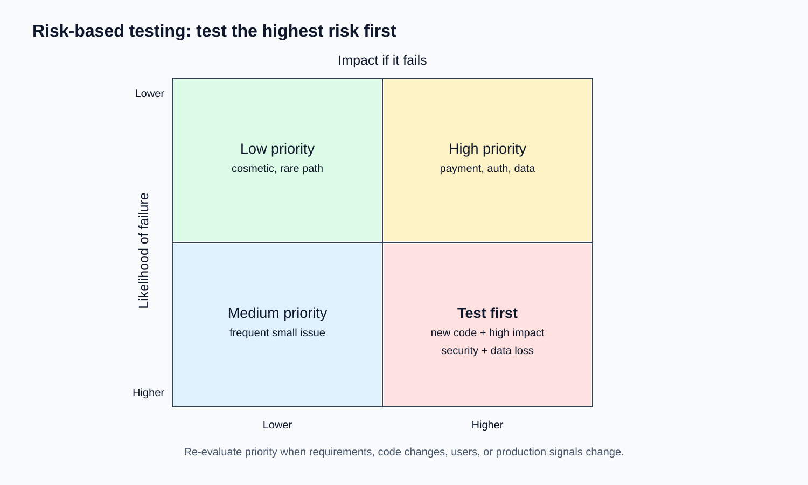
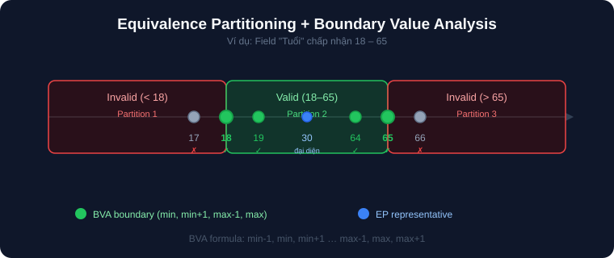
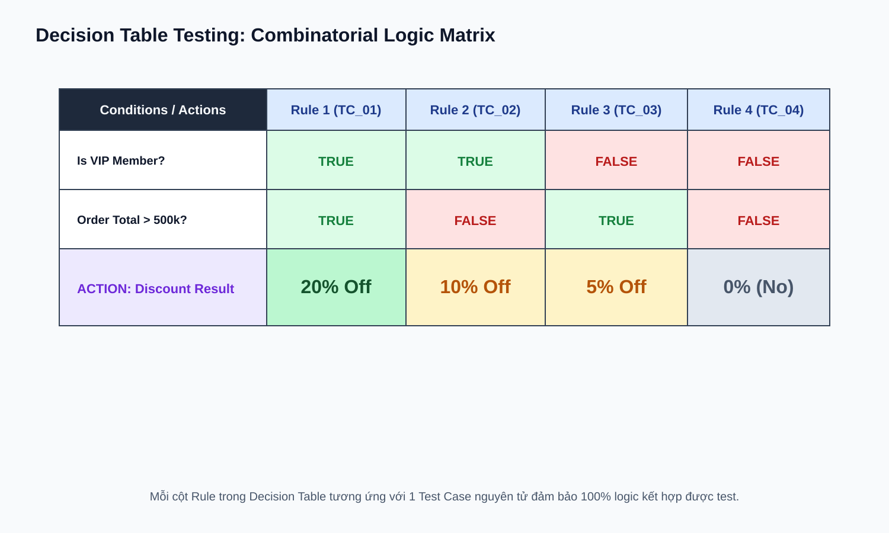
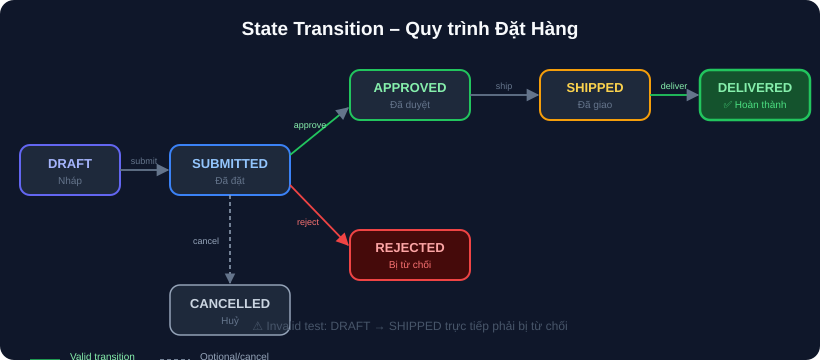

# 03 — Test Design & Techniques: Kỹ Thuật Thiết Kế Test

## Mục tiêu
Nắm vững 6 kỹ thuật thiết kế test case chuẩn quốc tế (Black-box Test Design Techniques) giúp tối ưu hóa số lượng test case mà vẫn đảm bảo độ bao phủ (coverage) cao nhất.

---

## 1. Risk-Based Testing Prioritization

Tập trung test những vùng có **Mức độ rủi ro cao nhất** (Impact lớn x Khả năng lỗi cao) trước tiên.

---

## 2. Equivalence Partitioning (EP) & Boundary Value Analysis (BVA)

- **EP (Phân vùng tương đương):** Chia tập dữ liệu đầu vào thành các nhóm mà hệ thống xử lý giống nhau. Chỉ chọn 1 giá trị đại diện cho mỗi nhóm.
- **BVA (Phân tích giá trị biên):** Lỗi phần mềm thường tập trung ở BIÊN của ranh giới (min-1, min, min+1, max-1, max, max+1).

---

## 3. Decision Table Testing (Bảng quyết định)

Dùng khi kết quả phụ thuộc vào NHIỀU ĐIỀU KIỆN kết hợp. Mỗi cột Rule tương ứng 1 Test Case chuẩn xác.

---

## 4. State Transition Testing (Chuyển đổi trạng thái)

Dùng cho các đối tượng có vòng đời và trạng thái phức tạp (Đơn hàng, Vé máy bay, Tài khoản).

---

## 5. Pairwise Testing & Error Guessing

- **Pairwise Testing:** Đảm bảo mọi CẶP biến số được test ít nhất 1 lần, giúp giảm 80-90% số lượng test case.
- **Error Guessing:** Dùng trực giác và kinh nghiệm để đoán chỗ hay lỗi (Nhập emoji, copy-paste trailing space, double click submit, SQL injection string `' OR '1'='1`).

---

## Checklist & Bài tập
- [ ] Áp dụng EP và BVA cho field Password (8 - 20 ký tự, chứa ít nhất 1 chữ hoa, 1 số).
- [ ] Lập Decision Table cho tính năng áp dụng mã Voucher.
- [ ] Vẽ State Transition Diagram cho quy trình Đặt hàng online.
