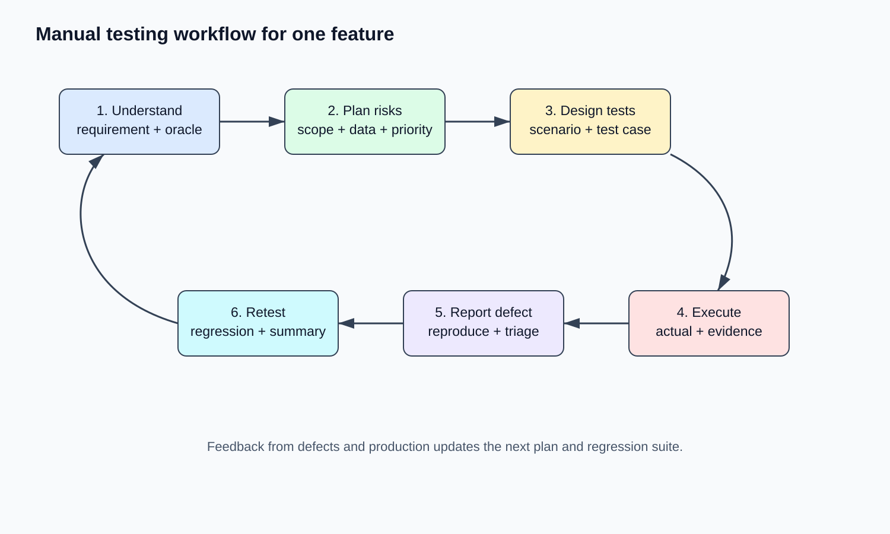
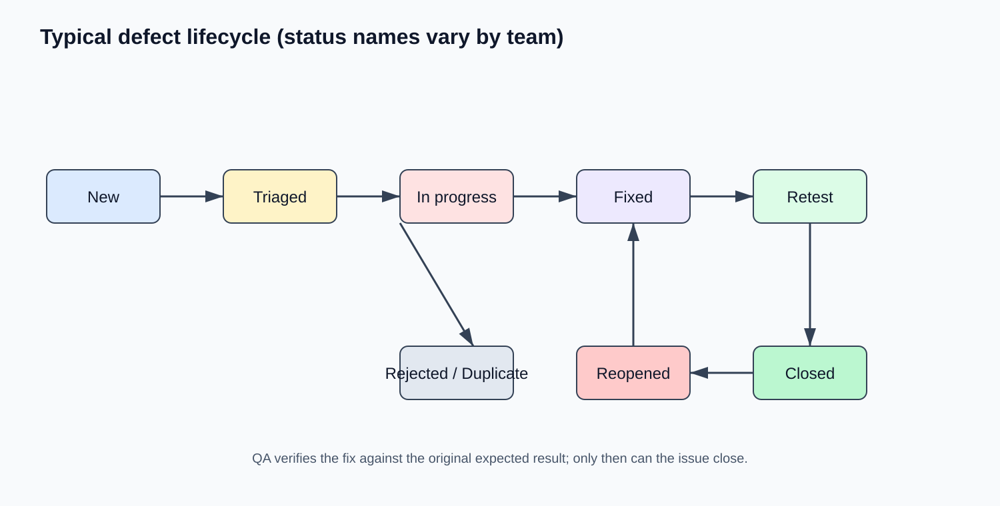
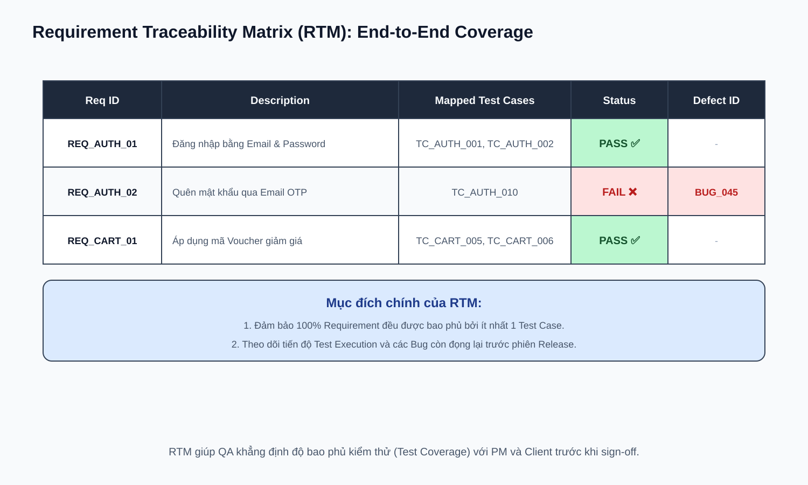

# 04 — Manual Testing Workflow: Quy Trình Manual Test

## Mục tiêu
Thành thạo kỹ năng viết Test Plan, viết Test Case chuẩn atomic, viết Bug Report chuyên nghiệp mà Developer đọc xong có thể reproduce được ngay, và xây dựng Requirement Traceability Matrix (RTM).

---

## 1. Manual Test Cycle



---

## 2. Cấu trúc Test Case chuẩn

| Field | Description | Example |
|---|---|---|
| **Test Case ID** | Mã định danh duy nhất | `TC_AUTH_001` |
| **Title** | Tên mô tả ngắn gọn action & expected | Verify login with valid email and password |
| **Precondition** | Điều kiện cần có trước khi test | User account `user@test.com` exists and is active |
| **Test Data** | Dữ liệu cụ thể dùng để test | Email: `user@test.com`, Password: `Password123!` |
| **Steps** | Các bước chi tiết (Atomic & Clear) | 1. Open `/login`<br>2. Enter Email & Password<br>3. Click "Login" |
| **Expected Result** | Kết quả kỳ vọng chuẩn xác | Redirect to `/dashboard`, toast "Welcome back" appears |
| **Priority** | High / Medium / Low | High |

---

## 3. Quy chuẩn viết Bug Report & Defect Lifecycle



```markdown
### [Auth] Error 500 khi đăng nhập bằng Google OAuth với email có dấu '+'

**Environment:** Chrome 126 / macOS 15.2 / Staging
**Severity:** Major | **Priority:** High

**Precondition:** Tài khoản Google có email format `user+test@gmail.com`

**Steps to Reproduce:**
1. Mở trang `/login`
2. Click nút "Login with Google"
3. Chọn tài khoản Google `user+test@gmail.com`

**Expected Result:** Đăng nhập thành công, điều hướng về `/dashboard`
**Actual Result:** Trang trắng, Console hiện `Error 500: Internal Server Error`. Network log đính kèm.
```

---

## 4. Requirement Traceability Matrix (RTM)



---

## Checklist & Bài tập
- [ ] Chọn 1 feature trong ứng dụng của bạn, viết 10 Test Cases chuẩn format.
- [ ] Tự tạo 1 Bug Report mẫu cho lỗi bạn tìm được trên webapp.
- [ ] Lập bảng RTM cho module User Profile.
