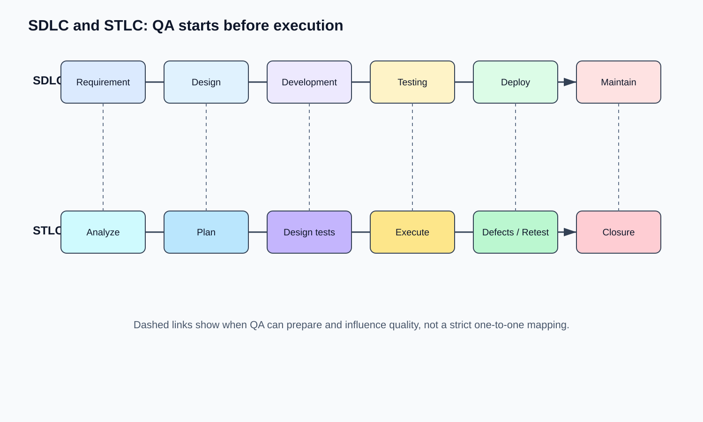
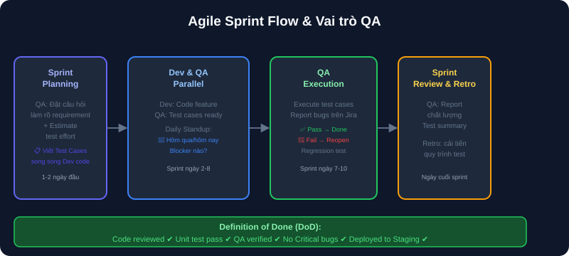
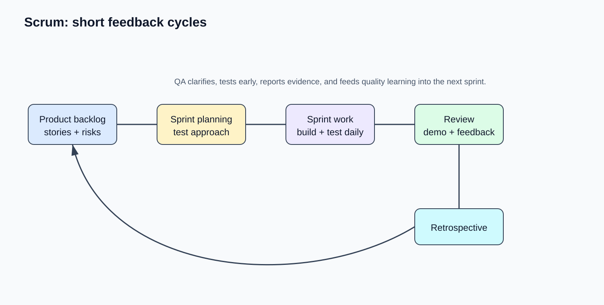

# 05 — SDLC, STLC & Agile/Scrum Workflow

## Mục tiêu
Hiểu rõ vòng đời phát triển phần mềm (SDLC), vòng đời kiểm thử (STLC), vai trò và công việc hàng ngày của QA trong team Agile/Scrum.

---

## 1. SDLC vs STLC Life Cycle

---

## 2. Agile Sprint Flow & Vai trò của QA

---

## 3. Scrum Feedback Loop & Definition of Done (DoD)

Một User Story chỉ được xem là **DONE** khi:
- [x] Code đã được Code Review.
- [x] Unit Test & Integration Test PASS.
- [x] QA đã Execute toàn bộ Test Cases & Verified PASS.
- [x] Không còn open Critical / Major bugs.
- [x] Code đã deploy thành công lên Staging/Production.
