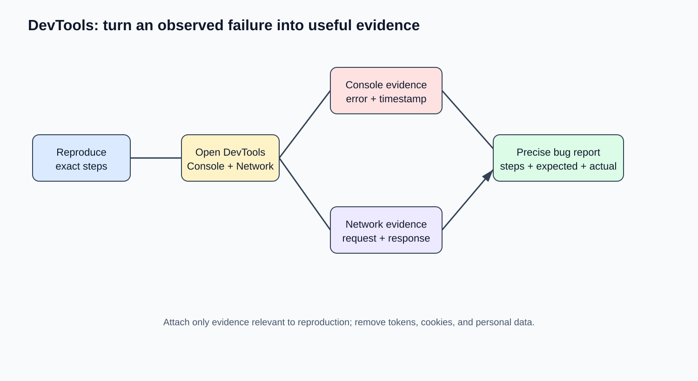
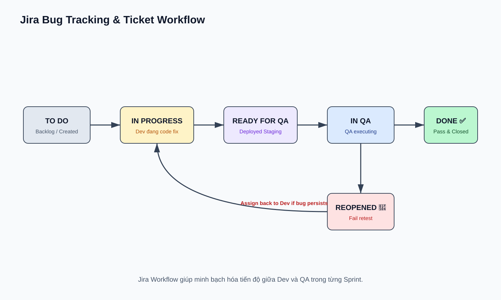

# 06 — Tools & Workflow: Công Cụ & Quản Lý Bug

## Mục tiêu
Thành thạo công cụ Chrome DevTools cho mục đích QA, quản lý bug trên Jira/Trello, làm quen với TestRail và Docker test environment.

---

## 1. Chrome DevTools qua góc nhìn QA



- **Console Tab:** Phát hiện các lỗi JavaScript ẩn (Uncaught TypeError, Red Console Errors).
- **Network Tab:** Check API Request/Response status (200, 400, 500), payload gửi đi, response data, và timing latency.
- **Application Tab:** Kiểm tra LocalStorage, SessionStorage, Cookies (Verify Token, Session Expiry).
- **Lighthouse Tab:** Audit nhanh chỉ số Performance, Accessibility (a11y), SEO.

---

## 2. Quản lý Bug trên Jira / Trello



---

## 3. Test Management Tools (TestRail) & Docker

- **TestRail:** Quản lý Repository Test Cases theo cây thư mục, tạo các Test Runs cho từng phiên bản release.
- **Docker cho QA:** Chạy ứng dụng và database isolated trong container để đảm bảo môi trường test đồng nhất giữa Local và CI:
```bash
docker-compose -f docker-compose.test.yml up -d
```
