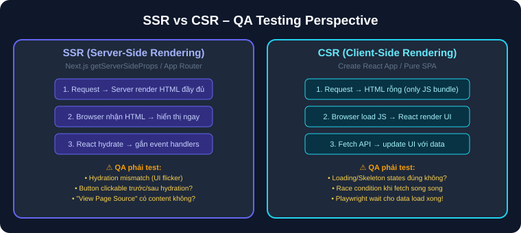
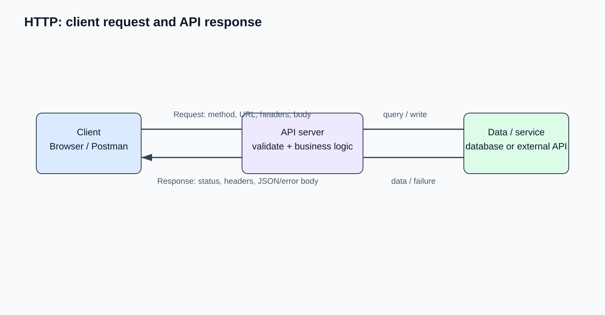
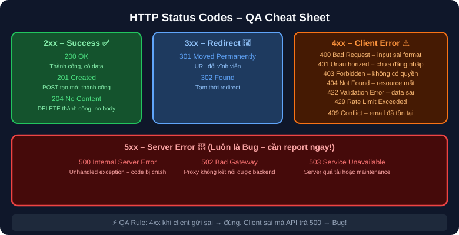

# 07 — Web & API Fundamentals: Kiến Thức Web & API cho QA

## Mục tiêu
Nắm vững cơ chế Web (SSR vs CSR, Hydration, Caching), HTTP Methods, Status Codes, và danh sách kiểm tra (Checklist) khi test API.

---

## 1. Web Architecture: SSR vs CSR

- **SSR (Next.js):** HTML được render từ server. QA cần chú ý lỗi **Hydration Mismatch**.
- **CSR (React SPA):** HTML rỗng, JS render UI. QA cần chú ý các trạng thái **Loading/Skeleton**.

---

## 2. HTTP Request / Response & Status Codes

### HTTP Request & Response Lifecycle

### HTTP Status Codes Cheat Sheet cho QA

---

## 3. API Testing Checklist (Postman / cURL)

- [ ] Verify Response Status Code khớp với scenario (Happy path & Error path).
- [ ] Verify JSON Response Schema (đúng kiểu dữ liệu string, number, boolean, array).
- [ ] Verify Authentication & Authorization (Thử bỏ Token ➔ Phải nhận 401).
- [ ] Verify Validation error messages (Báo rõ ràng field nào bị lỗi).
- [ ] Verify Response Time (< 200ms cho API thường).
