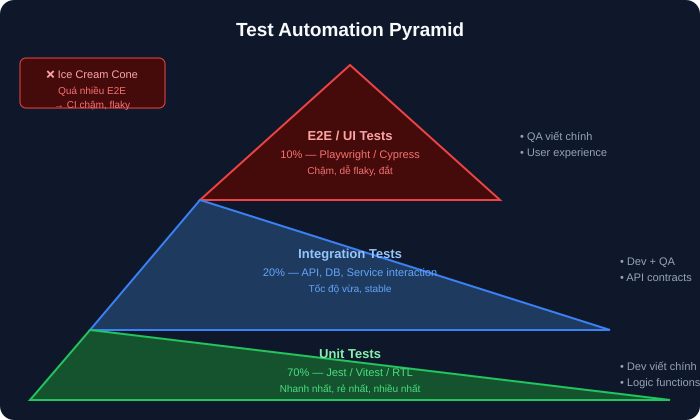

# 08 — Automation Foundations: Nền Tảng Kiểm Thử Tự Động

## Mục tiêu
Hiểu mô hình Kim tự tháp Automation (Test Automation Pyramid), chiến lược chọn test case để tự động hóa, và làm chủ Playwright Core (Locators, Actions, Assertions, Smart Waits).

---

## 1. Test Automation Pyramid



### Cái gì NÊN vs KHÔNG NÊN Automate?
- **NÊN:** Regression test suite, Smoke test, Data-driven tests, API integration tests.
- **KHÔNG NÊN:** Feature mới UI đang đổi liên tục, Exploratory testing, Test chỉ chạy 1 lần.

---

## 2. Playwright Core Setup & Locators

### Cài đặt
```bash
npm init playwright@latest
```

### Locators (Ưu tiên theo Semantic & Accessibility)
```typescript
// 1. Best: Role-based (Semantic & User-facing)
page.getByRole('button', { name: 'Submit' })
page.getByRole('textbox', { name: 'Email' })

// 2. Good: Label & Text
page.getByLabel('Password')
page.getByText('Welcome back')

// 3. Test ID
page.getByTestId('submit-btn')
```

---

## 3. Smart Waits (Chống Flaky Test)

- Playwright tự động đợi element **visible, enabled, stable** trước khi click.
- ❌ KHÔNG dùng hard wait: `await page.waitForTimeout(3000)`
- ✅ DÙNG explicit wait: `await page.waitForResponse('/api/login')` hoặc `await expect(locator).toBeVisible()`
