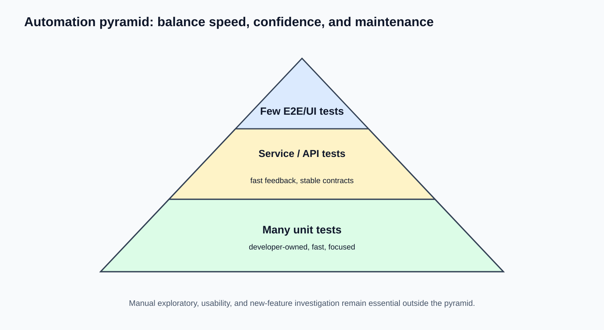

# 08 — Automation Foundations: học khi Manual đã vững

## Mục tiêu

Bạn hiểu automation là gì, chọn đúng test để tự động hóa, và có lộ trình bắt đầu Playwright hoặc Cypress mà không bỏ qua tư duy QA.

## Khi nào nên bắt đầu?

Bạn nên bắt đầu khi đã tự làm được: đọc requirement, viết test case, dùng locator qua DevTools, hiểu HTTP cơ bản, tạo bug report và chạy regression thủ công. Automation không thay thế việc thiết kế test.

## Lộ trình thực hiện

1. Chọn **một** tool: Playwright (mạnh cho modern web, đa browser) hoặc Cypress (DX dễ, phổ biến). Không học hai tool song song lúc đầu.
2. Học JavaScript/TypeScript cơ bản: biến, function, async/await, array/object, module.
3. Học locator ổn định: role, label, test id; tránh selector CSS/XPath quá phụ thuộc layout.
4. Viết test happy path nhỏ: login hoặc Add to Cart.
5. Thêm assertion rõ ràng: URL, message, visible state, cart count.
6. Tách test data, dùng setup/cleanup an toàn; không phụ thuộc thứ tự chạy.
7. Chạy local, xem trace/screenshot/video khi fail.
8. Nhận biết flaky test: timing, shared data, network, animation, locator yếu.
9. Đưa smoke/regression ổn định lên CI sau khi test local đáng tin.

## Chọn test để automation

Ưu tiên flow lặp lại thường xuyên, business-critical, ổn định và có expected result rõ: login, search, checkout smoke, API contract. Không ưu tiên exploratory, UX chủ quan, feature đang đổi liên tục hoặc one-time test.

## Checklist

- [ ] Chọn Playwright hoặc Cypress, không cả hai.
- [ ] Viết được một test UI có locator và assertion.
- [ ] Chạy test lại nhiều lần để xem có flaky không.
- [ ] Biết automation là bổ sung cho manual/exploratory chứ không thay thế.
