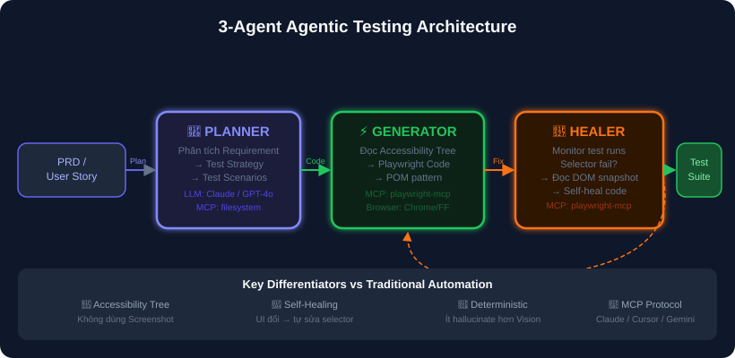
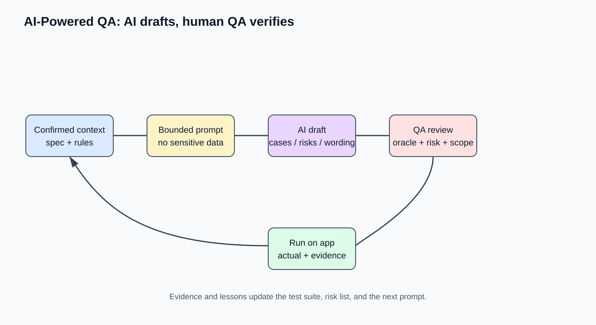

# 09 — AI-Powered QA: Ứng Dụng AI Trong Kiểm Thử (Trọng Tâm)

## Mục tiêu
Làm chủ việc ứng dụng AI/LLM trong quy trình QA: Prompt Engineering (Framework RCFCO), AI sinh Test Cases & Automation Code, sử dụng Microsoft Playwright MCP server, xây dựng mô hình Agentic Testing (Planner-Generator-Healer), và nắm rõ giới hạn của AI.

---

## 1. 3-Agent Agentic Testing Architecture (Playwright MCP)

1. **Planner Agent:** Đọc PRD/Requirement ➔ Sinh ra Test Strategy & Matrix scenarios.
2. **Generator Agent:** Đọc Accessibility Tree của App ➔ Sinh Playwright Test Code chuẩn POM.
3. **Healer Agent (Self-Healing):** Chạy test, khi Selector bị lỗi do UI đổi ➔ Tự đọc DOM snapshot mới và cập nhật lại Code.

---

## 2. Vòng lặp Review & Kiểm chứng AI Output

---

## 3. Prompt Engineering Framework cho QA (RCFCO)

Để AI cho ra Test Cases / Code chất lượng, dùng công thức **RCFCO**:
- **Role:** Vai trò của AI (Senior QA Engineer).
- **Context:** Ngữ cảnh feature, User story, Acceptance Criteria, Business rules.
- **Format:** Định dạng output (Bảng Markdown, JSON, Gherkin, Code TypeScript).
- **Constraint:** Ràng buộc (Platform, Browser, Data limits).
- **Output:** Phạm vi (Focus on Edge cases, Security, Boundary values).

---

## 4. Review Checklist cho AI-Generated Code

- [ ] Selector AI chọn có thực sự tồn tại và stable không?
- [ ] Assertion có đúng logic nghiệp vụ không?
- [ ] AI có lỡ dùng `waitForTimeout` (anti-pattern) không?
