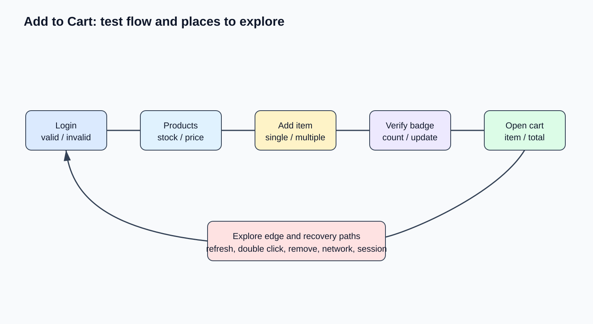

# 10 — Practice Projects: Các Bài Tập & Dự Án Thực Hành

## Mục tiêu
Áp dụng toàn bộ kiến thức đã học vào dự án webapp Next.js thật hoặc các trang web chuẩn QA (SauceDemo, TodoMVC, DemoQA).

---

## 📌 Project 1: Next.js App Test Suite (End-to-End)

Xây dựng bộ Test Suite cho ứng dụng Web:
- **Thư mục:** `tests/`
- **Nhiệm vụ 1 (Manual):** Viết 20 Manual Test Cases cho Authentication & CRUD Workflow.
- **Nhiệm vụ 2 (Automation):** Viết bộ Playwright Automation cho Luồng Login & Checkout dùng mô hình Page Object Model (POM).
- **Nhiệm vụ 3 (API):** Viết Playwright API Test cho các Endpoints REST backend.
- **Nhiệm vụ 4 (CI/CD):** Tích hợp chạy Test tự động trên GitHub Actions khi tạo Pull Request.
