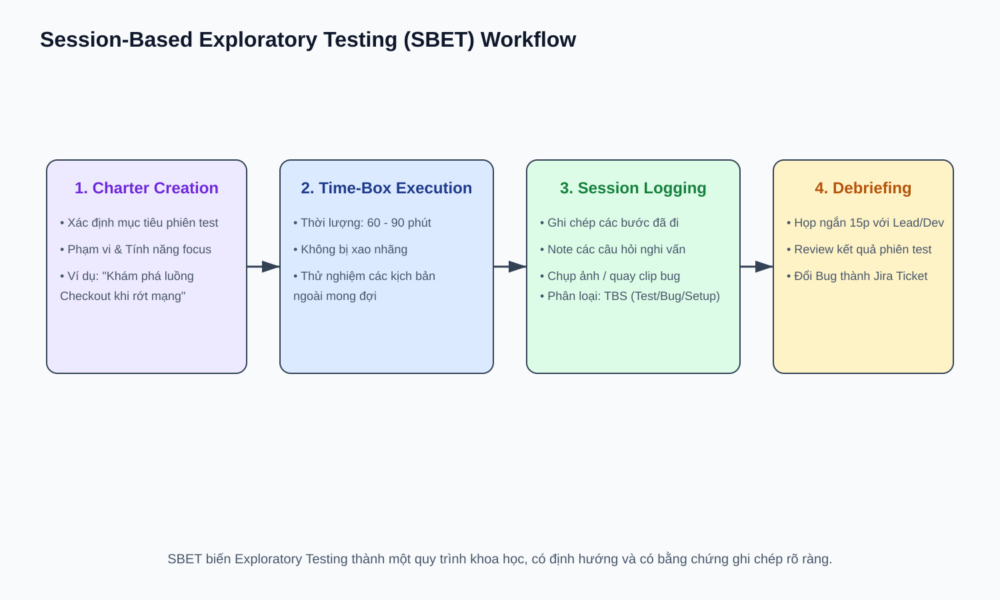

# 11 — Advanced Manual QA: Kỹ Thuật Manual QA Nâng Cao

## Mục tiêu
Làm chủ kỹ thuật Session-Based Exploratory Testing (SBET), kỹ năng Bug Advocacy (thuyết phục Dev/PM fix bug), và Pair Testing với Developer.

---

## 1. Session-Based Exploratory Testing (SBET)

Exploratory Testing không phải là test bừa bãi. SBET quản lý theo 4 bước quy chuẩn:
1. **Charter:** Mục tiêu phiên test (VD: "Khám phá luồng thanh toán khi mất kết nối mạng").
2. **Time-box:** Khung thời gian cố định (60 - 90 phút).
3. **Session Log:** Ghi chép chi tiết các bước, phát hiện, câu hỏi và lỗi.
4. **Debrief:** Họp ngắn với Team để review kết quả.
