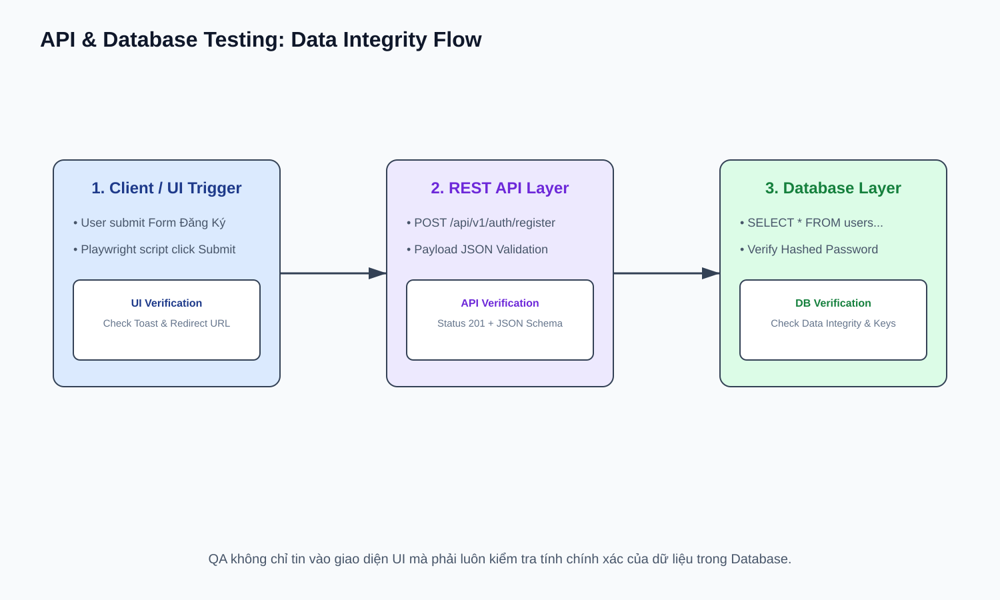

# 12 — API & Database Testing: Kiểm Thử API & Cơ Sở Dữ Liệu

## Mục tiêu
Sử dụng Playwright Request API để test API tự động và viết các câu lệnh SQL để xác minh tính toàn vẹn dữ liệu (Data Integrity) trong Database.

---

## 1. Luồng Kiểm Thử Data Integrity (UI ➔ API ➔ Database)



---

## 2. Playwright API Testing (`request`)

```typescript
import { test, expect } from '@playwright/test';

test('GET /api/products returns correct list', async ({ request }) => {
  const response = await request.get('/api/products');
  expect(response.status()).toBe(200);
  const data = await response.json();
  expect(data.length).toBeGreaterThan(0);
});
```

---

## 3. SQL Queries cho QA Verification

```sql
-- 1. Check user vừa đăng ký trong DB
SELECT id, email, is_active FROM users WHERE email = 'test@mail.com';

-- 2. Check dữ liệu trùng lặp (Data Integrity Failure)
SELECT email, COUNT(*) FROM users GROUP BY email HAVING COUNT(*) > 1;

-- 3. Check orphan records (Cascade Delete Fail)
SELECT o.id FROM orders o LEFT JOIN users u ON o.user_id = u.id WHERE u.id IS NULL;
```
