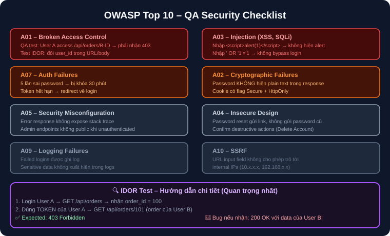

# 13 — Specialized Testing: Performance, Security & Accessibility

## Mục tiêu
Nắm vững khái niệm và thực hành cơ bản với k6 (Load Testing), OWASP Top 10 (Security Testing), AXE (Accessibility Testing), và Mobile Testing.

---

## 1. Security Testing (OWASP Top 10 Checklist)



---

## 2. Performance / Load Testing với k6

```javascript
import http from 'k6/http';
import { check, sleep } from 'k6';

export const options = {
  vus: 50,
  duration: '30s',
  thresholds: { http_req_duration: ['p(95)<500'] },
};

export default function () {
  const res = http.get('http://localhost:3000/api/products');
  check(res, { 'status is 200': (r) => r.status === 200 });
  sleep(1);
}
```
