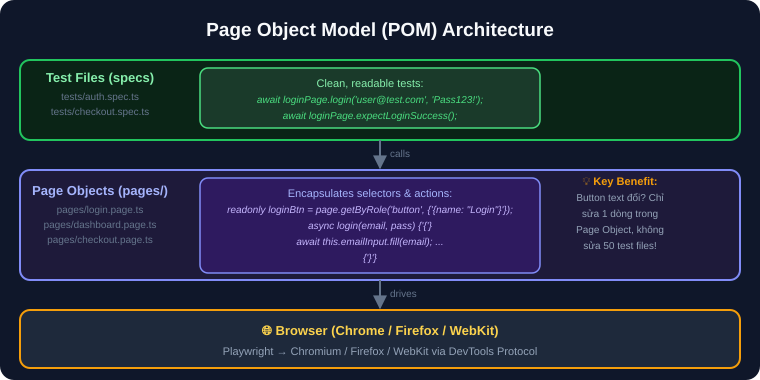
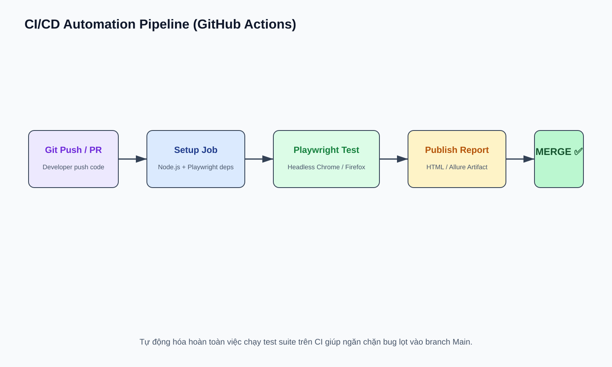

# 14 — Automation Engineering: Xây Dựng Framework Nâng Cao

## Mục tiêu
Làm chủ mô hình Page Object Model (POM), Quản lý Fixtures, Xử lý Flaky Tests, và Tích hợp CI/CD với GitHub Actions & Allure Report.

---

## 1. Page Object Model (POM) Pattern



---

## 2. CI/CD GitHub Actions Workflow



```yaml
name: Playwright Tests
on: [push, pull_request]
jobs:
  test:
    runs-on: ubuntu-latest
    steps:
      - uses: actions/checkout@v4
      - uses: actions/setup-node@v4
      - run: npm ci
      - run: npx playwright install --with-deps
      - run: npx playwright test
```
