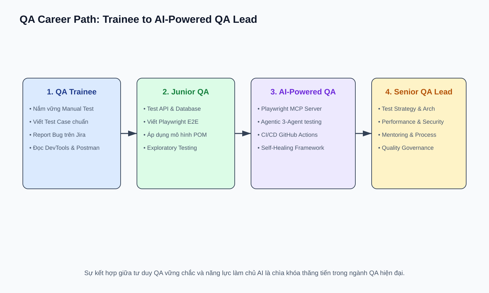

# 15 — Career & Real Projects: Hồ Sơ & Chuẩn Bị Phỏng Vấn

## Mục tiêu
Xây dựng Portfolio ấn tượng chứng minh cả tư duy QA lẫn năng lực AI, chuẩn bị sẵn sàng cho các câu hỏi phỏng vấn vị trí QA Trainee / Junior QA.

---

## 1. QA Career Progression Roadmap

---

## 📝 20+ Câu Hỏi Phỏng Vấn Mẫu & Định Hướng Trả Lời

1. **Phân biệt QA vs QC vs Testing?**
   - *Trả lời:* QA lo quy trình phòng ngừa lỗi, QC kiểm tra chất lượng sản phẩm, Testing là hoạt động thực thi tìm lỗi cụ thể.

2. **Cho ví dụ bug High Severity nhưng Low Priority?**
   - *Trả lời:* App crash khi nhập emoji vào trường ghi chú nội bộ rất ít khi dùng (Crash nặng nhưng ít user gặp).

3. **Phân biệt Smoke Testing vs Sanity Testing?**
   - *Trả lời:* Smoke test kiểm tra nhanh toàn bộ tính năng cơ bản sau build mới (Rộng, nông). Sanity test kiểm tra sâu tính năng vừa được sửa lỗi (Hẹp, sâu).

4. **Equivalence Partitioning & Boundary Value Analysis là gì?**
   - *Trả lời:* EP chia input thành các nhóm xử lý giống nhau. BVA tập trung test ở các biên của ranh giới các nhóm đó.

5. **Giải thích Bug Life Cycle? khi nào Reopen vs Reject?**
   - *Trả lời:* Reopen khi dev báo đã sửa nhưng QA test lại vẫn lỗi. Reject khi dev/PO xác nhận đó không phải bug (Behavior by design).

6. **Bạn ứng dụng AI vào công việc QA như thế nào?**
   - *Trả lời:* Dùng AI hỗ trợ sinh test case draft từ requirement (Prompt RCFCO), sinh Playwright test code, tóm tắt CI/CD log, và tự sửa test lỗi selector (Playwright MCP self-healing). Luôn review output của AI vì AI không có domain context ngầm.
