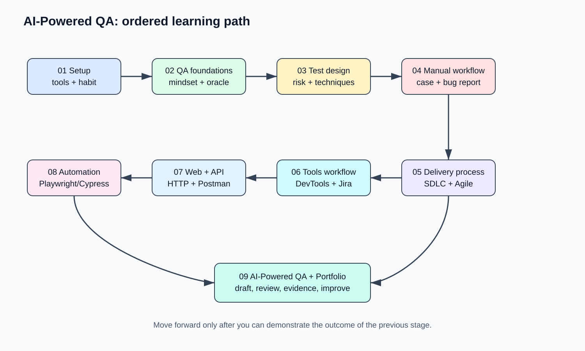

# AI-Powered QA Trainee Roadmap

Lộ trình này dành cho người mới bắt đầu từ con số 0. Bạn học Manual QA trước, hiểu web/API sau, rồi mới đi đến automation. Mỗi phần gồm mục tiêu, thứ tự thực hiện, checklist, bài tập và sơ đồ SVG để nhìn rõ mối liên hệ giữa các khái niệm.

> 📌 **Tài liệu tham khảo chuyên sâu:**
> - [📘 LEARNING-PATH.md — Lộ trình học sâu theo Dependency & Thực hành](LEARNING-PATH.md)
> - [🧪 ROADMAP.md — Roadmap tổng quan từ cơ bản tới nâng cao (Tích hợp AI)](ROADMAP.md)

> Nguyên tắc cốt lõi: AI giúp QA làm nhanh hơn, nhưng requirement, hành vi ứng dụng thật và sự review của con người mới quyết định kết quả đúng.

## Thứ tự học

| Chặng | Bạn học gì | Kết quả cần đạt |
| --- | --- | --- |
| [01. Bắt đầu](01-start-here/README.md) | Chuẩn bị máy, công cụ, cách học | Có môi trường và lịch học 2 tuần đầu |
| [02. QA foundations](02-qa-foundations/README.md) | QA mindset, approaches, oracle | Biết đặt câu hỏi và xác định đúng/sai |
| [03. Test design](03-test-design-and-techniques/README.md) | Risk, kỹ thuật và loại test | Biết chọn thứ cần test trước |
| [04. Manual workflow](04-manual-testing-workflow/README.md) | Plan, test case, execution, bug report | Có thể test một feature từ đầu đến cuối |
| [05. Delivery process](05-sdlc-stlc-agile/README.md) | SDLC, STLC, Agile/Scrum | Hiểu vai trò QA trong team |
| [06. Công cụ](06-tools-and-workflow/README.md) | DevTools, Jira/Trello, Sheets | Biết thu thập bằng chứng và quản lý bug |
| [07. Web & API](07-web-and-api-basics/README.md) | HTML/CSS/JS, HTTP, Postman | Đọc được request/response cơ bản |
| [08. Automation](08-automation-foundations/README.md) | Automation mindset, Playwright/Cypress | Biết hướng học automation đúng thời điểm |
| [09. AI-Powered QA](09-ai-powered-qa/README.md) | Prompt, review AI output, AI tools | Dùng AI an toàn trong quy trình test |
| [10. Dự án thực hành](10-practice-projects/README.md) | SauceDemo, portfolio | Có sản phẩm để nộp/đi phỏng vấn |
| [11. Advanced Manual QA](11-advanced-manual-qa/README.md) | Test design sâu hơn, thực chiến release | Nâng manual QA từ trainee lên junior |
| [12. API & Database Testing](12-api-and-database-testing/README.md) | Postman nâng cao, SQL, API contracts | Tự kiểm tra UI–API–data flow |
| [13. Mobile, Performance & Security](13-specialized-testing/README.md) | Mobile, accessibility, tải và security cơ bản | Biết các nhánh chuyên môn để chọn sâu hơn |
| [14. Automation Engineering](14-automation-engineering/README.md) | Framework, CI/CD, reporting, test architecture | Xây automation có thể bảo trì |
| [15. Career & Real Projects](15-career-and-real-projects/README.md) | Portfolio, phỏng vấn, dự án thật | Sẵn sàng ứng tuyển và tiếp tục phát triển |

## Cách dùng repo

1. Học lần lượt theo số thứ tự thư mục; không cần học hết mọi thứ trong một ngày.
2. Đọc phần **Mục tiêu** và **Các bước thực hiện** trước.
3. Hoàn thành checklist, sau đó làm bài tập của chương.
4. Lưu test case, bug report và ảnh/video bằng chứng trong thư mục portfolio của bạn.
5. Dùng AI để tạo bản nháp, nhưng luôn đối chiếu với requirement và ứng dụng thật.

Chạy `./roadmap.sh` để xem checklist ngắn ngay trong terminal.

## Lịch 2 tuần đầu

- **Tuần 1:** chặng 01 → 05; viết test case và bug report; exploratory test trên SauceDemo, DemoQA hoặc The Internet.
- **Tuần 2:** chặng 06 → 07; dùng DevTools, tạo ticket Jira/Trello, gửi request Postman đơn giản.
- **Sau tuần 2:** lặp lại dự án ở chặng 10. Chỉ học automation khi bạn đã tự viết và chạy được test manual.
- **Sau khi vững nền tảng:** mở lần lượt các chặng 11 → 15. Các folder này là backlog phát triển dài hạn, không cần học ngay.

## Tài liệu cũ

Nội dung từng nằm trong `fundamentals.md` đã được chia nhỏ vào các thư mục trên. File cũ vẫn được giữ như chỉ dẫn chuyển tiếp.
